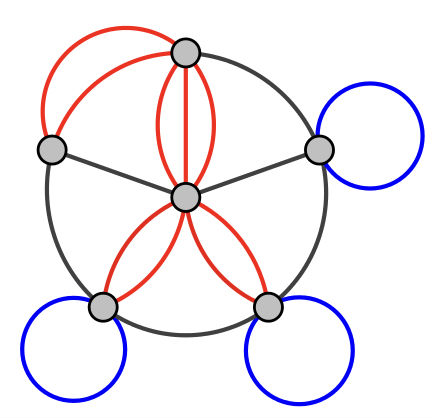
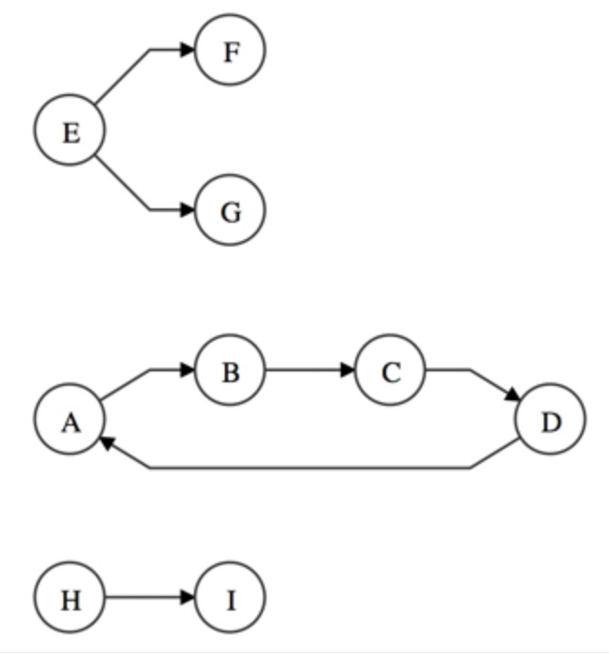
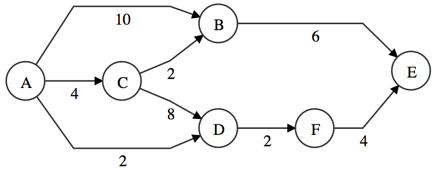
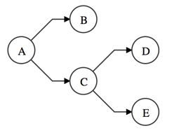
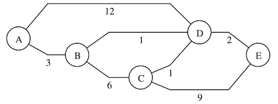
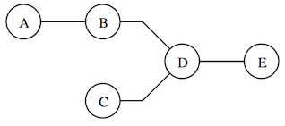
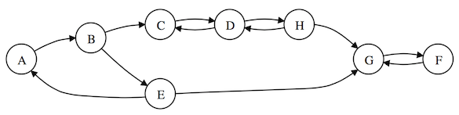
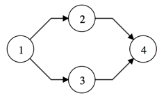

# 进度
- [x] 翻译 [API](https://github.com/dagrejs/graphlib/wiki/API-Reference) - 2022/03/23 21:06

> 中文 | [English](ReadMe.md)

[TOC]

# 安装
## npm Install
```shell
$ npm install @dagrejs/graphlib
```

# 介绍
`Graphlib`是一个JavaScript Lib库，为无向和有向多变图提供数据结构，以及可以一起使用的算法。

[](http://travis-ci.org/dagrejs/graphlib)

更多学习内容, 查看[wiki](https://github.com/cpettitt/graphlib/wiki)。

# API 指南
本部分主要阐述graphlib的概念并提供API指南。默认情况下，graphlib函数和对象暴露在graphlib的命名空间下。

# 图像概念
Graphlib有一种图类型: Graph。
创建一个新的实例:
```js
var g = new Graph();
```
默认情况下，将会创建一个不允许多边或者复合节点的有向图。以下则是参数选项:
- `directed`:设置为`true`时, 得到一个有向图。`false`时, 得到一个无向图。无向图不会把节点的顺序视为第一要务。换句话说, 对无向图来说`g.edge("a", "b") === g.edge("b", "a")`。默认为`true`
- `multigraph`: 设置为`true`时, 允许图像在同一对节点之间有多条边。默认: `false`。
- `compound`: 设置为`true`时, 允许图像有复合节点。 可以是其他节点的父节点。 默认为`false`。

可以在constructor中通过对象配置属性。比如，创建一个有向复合多边图:
```js
var g = new Graph({ directed: true, compound: true, multigraph: true });
```

# 展现节点和边线
在graphlib中，节点由用户提供的字符串id表示。 所有节点相关的函数都使用此字符串id作为唯一标识节点的方式。以下为与节点交互的例子:
```js
var g = new Graph();
g.setNode("my-id", "my-label");

g.node("my-id"); // return "my-label"
```

graphlib中的边由他们连接的节点标识。比如:
```js
var g = new Graph();

g.setEdge("source", "target", "my-label");
g.edge("source", "target"); // return my-label
```

但是，为了进行各种类型的边缘查询，我们需要一种方法去唯一标识单个对象里的边。(比如：[outEdges](https://github.com/dagrejs/graphlib/wiki/API-Reference#outEdges))。我们使用`edgeObj`应对，而此主要由以下组成:
- `v`: 源id或者是边线上的尾节点。
- `w`: 目标id或者是边线上的头节点。
- `name`(可选):  唯一标识多边边线([multi-edge](https://github.com/dagrejs/graphlib/wiki/API-Reference#multigraphs))的名称。

任何采用了一个边线id的边缘函数也可以使用`edgeObj`：
```js
var g = new Graph();

g.setEdge("source", "target", "my-label")
g.edge({ v: "source", w: "target" }); // return my-label
```

# Multigraphs
multigraphs的数学概念: [multigraph](https://en.wikipedia.org/wiki/Multigraph)


多重图是一种在一对节点中可以拥有多条边的图。默认情况下, graphlib的图像不是多重图, 需要在构造体中设置多重图的属性为`true`:
```js
var g = new Graph({ multigraph: true })
```
在两个节点由多条边的情况下，我们需要相同的办法去识别每一条边。 我们称这样的属性为`name`。 这有关于相同节点之间的几条边的例子:
```js
var g = new Graph({ multigraph: true })

g.setEdge("a", "b", "edge1-label", "edge1")
g.setEdge("a", "b", "edge2-label", "edge2")

g.edge("a", "b", "edge1")
g.edge("a", "b", "edge2")

g.edges()
/**
 * return [
 *  { v: "a", w: "b", name: "edge1" },
 *  { v: "a", w: "b", name: "edge2" }
 * ]
 */
```

多重图也允许创建没有名字的一条边
```js
var g = new Graph({ multigraph: true })

g.setEdge("a", "b", "my-label")
g.edge({ v: "a", w: "b" })
```

# 复合图
复合图就是一个节点可以是其他节点的父节点。子节点组成一个"子图"。 以下例子为构建一个复合图并与之交互:
```js
var g = new Graph({ compound: true });

g.setParent("a", "parent");
g.setParent("b", "parent");

g.parent("a"); // returns "parent"
g.parent("b"); // returns "parent"

g.parent("parent"); // returns undefined
```

# 默认标签
当一个节点或边没有创建标签时，会被默认分配一个标签。详情请看这两个API:
- [setDefaultNodeLabel](https://github.com/dagrejs/graphlib/wiki/API-Reference#setDefaultNodeLabel)
- [setDefaultEdgeLabel](https://github.com/dagrejs/graphlib/wiki/API-Reference#setDefaultEdgeLabel)

# Graph API

## graph.isDirected()
如果图是有向图的话，会返回`true`。
有向图会将在线段里的节点顺序是做有意义的，而无向图则会忽视。以下例子证明了不同:
```js
var directed = new Graph({ directed: true });

directed.setEdge("a", "b", "my-label");
directed.edge("a", "b"); // returns my-label
directed.edge("b", "a"); // returns undefined

var undirected = new Graph({ directed: false });
undirected.setEdge("a", "b", "my-label");
undirected.edge("a", "b"); // returns my-label
undirected.edge("b", "a"); // returns my-label
```

## graph.isMultigraph()
如果图是多重图，返回`true`。[Multigraph](https://github.com/dagrejs/graphlib/wiki/API-Reference#multigraphs)

## graph.isCompound()
如果是复合图，返回`true`。[compound](https://github.com/dagrejs/graphlib/wiki/API-Reference#compound-graphs)

## graph.graph()
返回为图形分配的标签。 如果没有指定标签，则返回`undefined`。
```js
var g = new Graph();

g.graph(); // return undefined
g.setGraph("graph-label");
g.graph(); // return "graph-label"
```

## graph.setGraph(label)
为图像设置标签。

## graph.nodeCount()
返回图像中节点的数量。

## graph.edgeCount()
返回节点中边线的数量。

## graph.setDefaultNodeLabel(val)
设置一个新的默认值，以便于在没有指定标签创建节点时，分配过去。
如果`val`不是一个函数，将会作为标签分配。
如果是一个函数, 正被创建的节点的id将会调用此函数。

## graph.setDefaultEdgeLabel(val)
为没有分配标签的线段指定一个新的默认标签。
如果`val`不是函数，则作为标签。
如果是函数，则会随着参数`(v, w, name)`而被调用。

## graph.nodes()
返回图像里的所有节点id。
使用[node(v)](https://github.com/dagrejs/graphlib/wiki/API-Reference#node)获取每个节点的标签，花费`O(|v|)`的时间。

## graph.edges()
返回图中的每个边线的[edgeObj](https://github.com/dagrejs/graphlib/wiki/API-Reference#node-and-edge-representation)。
使用[edge(edgeObj)](https://github.com/dagrejs/graphlib/wiki/API-Reference#edge)获取每个边线的标签。花费`O(|v|)`的时间。

## graph.sources()
返回图中没有入边的节点。

## graph.sinks()
返回途中没有出边的节点。

## graph.hasNode(v)
如果图里存在节点的id为`v`，则返回`true`。

## graph.node(v)
如果图中存在id为`v`的节点，则返回指定的标签，否则返回`undefined`。

## graph.setNode(v, [label])
在图中创建或更新节点v的值。 如果提供了label，则更新掉。如果没有提供，在创建过程中会分配一个默认的标签。[default node label](https://github.com/dagrejs/graphlib/wiki/API-Reference#default-labels)。

返回图，允许图和其他的函数连接起来。

## graph.removeNode(v)
移除图中id为`v`的节点，如果不存在则不处理。如果节点被移除，也会移除所有边。
返回图，允许图和其他的函数连接起来。

## graph.predecessors(v)
返回指定节点的所有前导节点，如果图中不存在此节点，则返回`undefined`. 如果是无向图，则会返回`undefined`，应该使用[neighbors](https://github.com/dagrejs/graphlib/wiki/API-Reference#neighbors)。

## graph.successors(v)
返回指定节点的所有后续节点。如果图中没有此节点，则返回`undefined`. 如果是无向图，则会返回`undefined`，应该使用[neighbors](https://github.com/dagrejs/graphlib/wiki/API-Reference#neighbors)。

## graph.neighbors(v)
返回指定节点的前导节点或者后续节点。如果图中没有此节点，则返回`undefined`。

## graph.inEdges(v, [u])
返回所有指向节点(v)的边。 可以过滤出只来自于节点u的边。 
对无向图来说都是`undefined`，请使用[nodeEdges](https://github.com/dagrejs/graphlib/wiki/API-Reference#nodeEdges)。
如果图中没有节点`v`，则返回`undefined`。


## graph.outEdges(v, [w])
返回所有指向节点的边。可以过滤出只指向节点w的边。
对无向图来说都是`undefined`，请使用[nodeEdges](https://github.com/dagrejs/graphlib/wiki/API-Reference#nodeEdges)。
如果图中没有节点`v`，则返回`undefined`。

## graph.nodeEdges(v, [w])
返回所有与节点v有关的边，而不管方向。
可以过滤出节点v和w之间的所有线段，无论方向。
如果图中没有节点`v`，则返回`undefined`。

## graph.parent(v)
返回节点v的父节点。
如果节点没有父节点或不在图中，则返回`undefined`。
如果不是复合图的话，始终返回`undefined`。

## graph.children(v)
返回节点v的所有孩子节点。
如果不在图中则返回`undefined`。
如果不是复合图，始终返回`[]`。

## graph.setParent(v, parent)
如果`parent`有值，则设置为节点v的父节点; 如果没有值，则移除节点v的父节点。
如果图不是复合图，则抛出异常。
返回值为图本身，允许被连接到其他的函数内。

## graph.hasEdge(v, w, [name]) / graph.hasEdge(edgeObj)
如果图中的节点v和节点w之间存在一条边，名字为`name`,则返回`true`。
[name]参数只适用于多重图。
对于无向图来说,v和w可以互换位置。

## graph.edge(v, w, [name]) / graph.edge(edgeObj)
如果图中节点v和w之间存在线段，并带有可选名称，则返回线段(v,w)的标签。
如果图中没有这条线，则返回`undefined`。
参数[name]只适用于多重图。
无向图中,v,w可以互换。

## graph.setEdge(v, w, [label], [name]) / graph.setEdge(edgeObj, [label])
使用参数[name]去创建或更新(v,w)的边。
如果提供了[label]，则将其设置为边的值。而如果没有被提供，则将分配给默认的标签。
参数[name]只适用于多重图。
返回值为图本身，允许被连接到其他的函数内。

## graph.removeEdge(v, w, [name])
如果图中的节点v,w之间有一条可选名[name]的边，则移除它。否则将无效。
参数[name]只适用于多重图。
无向图中,v,w可以互换。


# 序列化
## json.write(g)
创建可以用JSON序列化为字符串的图形的JSONrepresentation。稍后可以使用[json-read](https://github.com/dagrejs/graphlib/wiki/API-Reference#json-read)恢复图形。

```js
var g = new graphlib.Graph();
g.setNode("a", { label: "node a" });
g.setNode("b", { label: "node b" });
g.setEdge("a", "b", { label: "edge a->b" });
graphlib.json.write(g);
// Returns the object:
//
// {
//   "options": {
//     "directed": true,
//     "multigraph": false,
//     "compound": false
//   },
//   "nodes": [
//     { "v": "a", "value": { "label": "node a" } },
//     { "v": "b", "value": { "label": "node b" } }
//   ],
//   "edges": [
//     { "v": "a", "w": "b", "value": { "label": "edge a->b" } }
//   ]
// }
```

## json.read(json)
将输入的json转换为图像的展示类型。比如，我们使用`json-write`将图像序列化为`str`的字符串，我们可以使用以下的办法去恢复:
```js
var g2 = graphlib.json.read(JSON.parse(str));
// or, in order to copy the graph
var g3 = graphlib.json.read(graphlib.json.write(g))

g2.nodes();
// ['a', 'b']
g2.edges()
// [ { v: 'a', w: 'b' } ]
```

# 算法
## alg.components(graph)
找到图中所有的连接部分，并且将这些部分作为数组返回。
每个组件本身就是一个数组，包含组件中节点id。

```js
graphlib.alg.components(g);
// => [ [ 'A', 'B', 'C', 'D' ],
//      [ 'E', 'F', 'G' ],
//      [ 'H', 'I' ] ]
```

## alg.dijkstra(graph, source, weightFn, edgeFn)
此算法是[Dijkstra]算法的js版本. 旨在从g的源节点到其他任意节点的最短路径。

这个函数将会返回一个map结构:
`v -> { distance, predecessor }`

distance属性会保存从source到v的最短路径权重之和。
如果从source过来没有路径，则结果为正无穷大。

predecessor属性可以按照相反顺序遍历source到v的每个元素。

根据`weightFn(e)`来返回边e的权重。如果没有赋值，默认的每条边的权重是1.
如果任何遍历的边具有负边权重，则此函数将抛出错误。

edgeFn（v）会返回与节点v相关的所有边的ID，以便进行最短路径遍历。默认使用`g.outEdges`。

例子：


```js
function weight(e) { return g.edge(e); }

graphlib.alg.dijkstra(g, "A", weight);
// => { A: { distance: 0 },
//      B: { distance: 6, predecessor: 'C' },
//      C: { distance: 4, predecessor: 'A' },
//      D: { distance: 2, predecessor: 'A' },
//      E: { distance: 8, predecessor: 'F' },
//      F: { distance: 4, predecessor: 'D' } }
```

## alg.dijkstraAll(graph, weightFn, edgeFn)
此函数用于查找从每个节点到其他每个可到达节点到最短距离。
与`alg.dijkstra`类似，但返回的不是单个数组，而是返回一个map映射: `source -> alg.dijkstra(g, source, weightFn, edgeFn)`

函数的`weightFn`返回边`e`的权重。如果没有指定，则默认为1。如果可遍历的边有负数，则会立即抛出错误。

函数的`edgeFn(u)`返回所有与节点`u`有关的边的id，以便于进行最短路径的遍历。默认使用`g.outEdges`。

例子:


```js
function weight(e) { return g.edge(e); }

graphlib.alg.dijkstraAll(g, function(e) { return g.edge(e); });

// => { A:
//       { A: { distance: 0 },
//         B: { distance: 6, predecessor: 'C' },
//         C: { distance: 4, predecessor: 'A' },
//         D: { distance: 2, predecessor: 'A' },
//         E: { distance: 8, predecessor: 'F' },
//         F: { distance: 4, predecessor: 'D' } },
//      B:
//       { A: { distance: Infinity },
//         B: { distance: 0 },
//         C: { distance: Infinity },
//         D: { distance: Infinity },
//         E: { distance: 6, predecessor: 'B' },
//         F: { distance: Infinity } },
//      C: { ... },
//      D: { ... },
//      E: { ... },
//      F: { ... } }
```

## alg.findCycles(graph)
假定存在一个图`g`，此函数将会返回图中循环的部分。

由于图中不止有1个循环，所以该函数返回有循环体所构成的数组，而每个循环体由涉及的节点id构成。

如果要判断图是否有循环部分，请使用`g.isAcyclic`则更为高效。

```js
var g = new graphlib.Graph();
g.setNode(1);
g.setNode(2);
g.setNode(3);
g.setEdge(1, 2);
g.setEdge(2, 3);
 
graphlib.alg.findCycles(g);
// => []

g.setEdge(3, 1);
graphlib.alg.findCycles(g);
// => [ [ '3', '2', '1' ] ]

g.setNode(4);
g.setNode(5);
g.setEdge(4, 5);
g.setEdge(5, 4);
graphlib.alg.findCycles(g);
// => [ [ '3', '2', '1' ], [ '5', '4' ] ]
```

## alg.isAcyclic(graph)
给定一个图`g`，如果该图有循环的部分，则返回`true`。否则，返回`false`。

该函数会返回检测到的第一个循环体。如果要获取全部内容，请使用`alg.findCycles`。

```js
var g = new graphlib.Graph();
g.setNode(1);
g.setNode(2);
g.setNode(3);
g.setEdge(1, 2);
g.setEdge(2, 3);

graphlib.alg.isAcyclic(g);
// => true

g.setEdge(3, 1);
graphlib.alg.isAcyclic(g);
// => false
```

## alg.postorder(graph, vs)
该函数将会从图像g的节点vs开始，进行后序遍历。

对于访问的每个节点，假定节点名为`v`，将会调用`callback(v)`。

```js
graphlib.alg.postorder(g, "A");
// => One of:
// [ "B", "D", "E", C", "A" ]
// [ "B", "E", "D", C", "A" ]
// [ "D", "E", "C", B", "A" ]
// [ "E", "D", "C", B", "A" ]
```

## alg.preorder(graph, vs)
该函数将会从图像g的节点vs开始，进行前序遍历。
对于访问的每个节点，假定节点名为`v`，将会调用`callback(v)`。

```js
graphlib.alg.preorder(g, "A");
// => One of:
// [ "A", "B", "C", "D", "E" ]
// [ "A", "B", "C", "E", "D" ]
// [ "A", "C", "D", "E", "B" ]
// [ "A", "C", "E", "D", "B" ]
```

## alg.prim(graph, weightFn)
Prim算法采用连通无向图，并生成最小生成树。
[Prim's algorithm](https://en.wikipedia.org/wiki/Prim's_algorithm).

该函数将会以无向图的形式返回最小生成树。这个算法取自《算法导论》。

weightFn(e)将会返回边的权重e，如果图没有被联通，则会抛出异常。


```js
function weight(e) { return g(e); }
graphlib.alg.prim(g, weight);
```

返回的树，以图的形式展现:


## alg.tarjan(graph)
[Tarjan's algorithm](http://en.wikipedia.org/wiki/Tarjan's_strongly_connected_components_algorithm)

该函数是Tarjan算法的一个实现，该算法在有向图g中找到所有[强连通分量](http://en.wikipedia.org/wiki/Strongly_connected_component)

每个强连通分量由节点组成，这些节点可以通过定向边到达分量中的所有其他节点。

如果一个强连接的组件既不能到达图中的任何其他特定节点，也不能被该节点访问，则该组件可以由单个节点组成。多个节点的组件要保证至少有一个循环。

此函数将会返回一个组件数组。每个组件本身也是一个数组，并且包含了组件内所有节点的id。

```js
graphlib.alg.tarjan(g);
// => [ [ 'F', 'G' ],
//      [ 'H', 'D', 'C' ],
//      [ 'E', 'B', 'A' ] ]
```

## alg.topsort(graph)
[topological sorting](https://en.wikipedia.org/wiki/Topological_sorting)

topological 排序算法的实现。

给定一个图`g`，该函数返回一个节点数组，使得每个边`u -> v`， u出现在v之前。
如果图有循环，则不可能生成列表，并抛出异常。


```js
graphlib.alg.topsort(g)
// [ '1', '2', '3', '4' ] or [ '1', '3', '2', '4' ]
```

